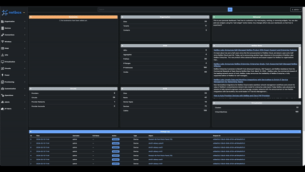

# Netbox Reorder Rack Plugind

 

Allow the ability to reorder rack units in NetBox using a drag and drop interface.



## Installation

**_NOTE:_** For docker please see: [Docker install](https://github.com/netbox-community/netbox-docker/wiki/Using-Netbox-Plugins)

The plugin is available as a Python package and can be installed with pip.

Run the following commands to install the required package after activating the virtual environment:

```shell
source /opt/netbox/venv/bin/activate
pip install netbox-reorder-rack
```

To ensure the plugin is automatically re-installed during future upgrades, create a file named `local_requirements.txt` (if it does not exist already) in the NetBox root directory (alongside `requirements.txt`) and list the `netbox-reorder-rack` package:

```shell
echo netbox-reorder-rack >> local_requirements.txt
```

Once installed, the plugin needs to be enabled in your `configuration.py`

```python
# In your configuration.py
PLUGINS = ["netbox_reorder_rack"]
```

You may need to collect static files and restart NetBox for the plugin to be properly installed.

```shell
python3 manage.py collectstatic --no-input
systemctl restart netbox
```


## Compatibility Matrix

| netbox version | plugin version |
| -------------- | ----------------------------- |
| >= 3.7.0       | >= v1.0.0                     |

### Update

To update the plugin, you need to update the package and restart NetBox.

```shell
source /opt/netbox/venv/bin/activate
pip install netbox-reorder-rack
python3 manage.py collectstatic --no-input
systemctl restart netbox
```
