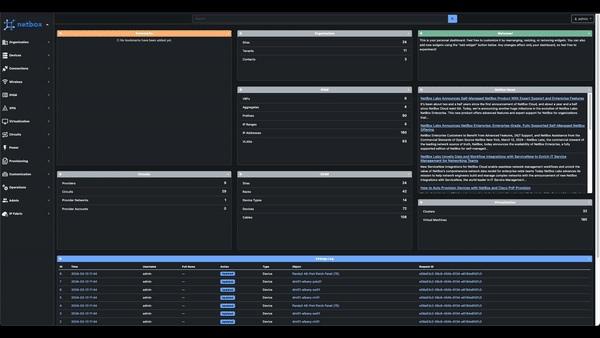
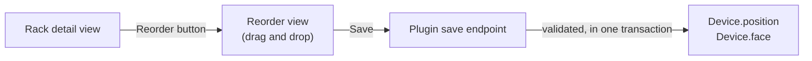

# NetBox Reorder Rack

Moving a device to a different position in a rack in NetBox means editing the device and typing a new position. Moving several — shifting a row of servers up two units, swapping two switches, pulling something out to the non-racked list — means repeating that once per device, with no view of the result until you are finished.

This plugin adds a drag-and-drop rack elevation. Open a rack, drag devices to where you want them, and save once. The layout you see while dragging is the layout that gets written.

## Features

* A **Reorder** button on every rack detail view, leading to a drag-and-drop elevation.

* Front and rear faces side by side, so a device can be dragged from one face to the other.

* Devices can be dragged out to a **Non-Racked Devices** list, clearing their position without deleting them, and dragged back in again.

* Full-depth devices are mirrored onto the opposite face automatically as they are placed.

* Three display modes — images and labels, images only, or labels only — matching how NetBox itself renders elevations.

* Nothing is written until **Save**, and the button stays disabled until something actually changes.

* Descending-unit racks are handled, so the elevation reads the same way round as the rack does.

## Terminology

* A **unit** is one rack U. Devices occupy one or more, and half-unit positions are supported by NetBox and preserved here.

* A **face** is the front or rear of the rack. A device sits on one face, unless it is full depth.

* A **full-depth** device occupies both faces, and so appears in both elevations.

* A **non-racked device** belongs to the rack but has no position. NetBox lists these separately, and this plugin makes that list a drag target.

## How It Works

The plugin adds no models and stores nothing of its own. It reads the current elevation from NetBox, lets the browser rearrange it, and writes the result back as ordinary device positions:

Every change ends up as a `position` and `face` on a `Device`, so the result is indistinguishable from having edited each device by hand — including change logging, which records each moved device individually.

!!! note
    Saving validates each device with NetBox's own `clean()` before writing, and the whole save runs in a single transaction. If any device would be invalid, nothing is written.

## Permissions

Both the reorder view and the save endpoint require `dcim.view_device` **and** `dcim.change_device`. Object-level permissions are honoured: the save is rejected if the user lacks permission on any individual device it would move.

The **Reorder** button is only shown to users with `dcim.change_device`.

## Getting Started

Continue to the [installation guide](installation.md), then [Reordering a Rack](usage.md).
